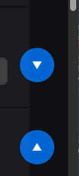
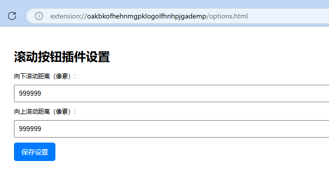

# chrome/Edge 浏览器悬浮滚动插件

该插件包括两个可拖动的按钮，一个用于向下滚动页面，另一个用于向上滚动页面。
滚动距离可以通过插件的设置页面进行配置。


预览



选项



安装插件方法


## 插件结构

```
scroll-buttons-extension/
├── manifest.json
├── content.js
├── options.html
├── options.js
├── styles.css
└── icons/
    ├── icon16.png
    ├── icon48.png
    └── icon128.png
```

### 1. `manifest.json`

这是插件的配置文件，定义了插件的基本信息、权限以及需要加载的脚本和页面。

```json
{
  "manifest_version": 3,
  "name": "滚动按钮插件",
  "version": "1.0",
  "description": "在浏览器右侧悬浮两个按钮，点击后可按配置滚动页面。",
  "icons": {
    "16": "icons/icon16.png",
    "48": "icons/icon48.png",
    "128": "icons/icon128.png"
  },
  "permissions": [
    "storage"
  ],
  "options_page": "options.html",
  "content_scripts": [
    {
      "matches": ["<all_urls>"],
      "js": ["content.js"],
      "css": ["styles.css"]
    }
  ]
}
```

### 2. `content.js`

内容脚本负责在每个网页上注入两个按钮，并实现按钮的拖动和点击滚动功能。

```javascript
// 获取滚动距离配置，默认值为500
chrome.storage.sync.get(['scrollDownDistance', 'scrollUpDistance'], function(result) {
    const scrollDownDistance = result.scrollDownDistance || 500;
    const scrollUpDistance = result.scrollUpDistance || 500;

    // 创建向下滚动按钮
    const downButton = document.createElement('div');
    downButton.id = 'scroll-down-button';
    downButton.innerHTML = '&#x25BC;'; // 向下箭头
    downButton.title = '向下滚动';
    document.body.appendChild(downButton);

    // 创建向上滚动按钮
    const upButton = document.createElement('div');
    upButton.id = 'scroll-up-button';
    upButton.innerHTML = '&#x25B2;'; // 向上箭头
    upButton.title = '向上滚动';
    document.body.appendChild(upButton);

    // 点击事件处理
    downButton.addEventListener('click', () => {
        window.scrollBy({ top: scrollDownDistance, left: 0, behavior: 'smooth' });
    });

    upButton.addEventListener('click', () => {
        window.scrollBy({ top: -scrollUpDistance, left: 0, behavior: 'smooth' });
    });

    // 拖动功能
    makeDraggable(downButton);
    makeDraggable(upButton);
});

// 拖动函数
function makeDraggable(element) {
    let isDragging = false;
    let startX, startY, initialLeft, initialTop;

    element.addEventListener('mousedown', function(e) {
        isDragging = true;
        startX = e.clientX;
        startY = e.clientY;
        const rect = element.getBoundingClientRect();
        initialLeft = rect.left;
        initialTop = rect.top;
        document.body.style.userSelect = 'none';
    });

    document.addEventListener('mousemove', function(e) {
        if (isDragging) {
            const deltaX = e.clientX - startX;
            const deltaY = e.clientY - startY;
            element.style.left = `${initialLeft + deltaX}px`;
            element.style.top = `${initialTop + deltaY}px`;
        }
    });

    document.addEventListener('mouseup', function() {
        if (isDragging) {
            isDragging = false;
            document.body.style.userSelect = 'auto';
        }
    });
}
```

### 3. `styles.css`

样式文件用于美化按钮并设置其初始位置和样式。

```css
#scroll-down-button, #scroll-up-button {
    position: fixed;
    right: 20px;
    width: 50px;
    height: 50px;
    background-color: rgba(0, 123, 255, 0.8);
    color: white;
    border-radius: 25px;
    display: flex;
    align-items: center;
    justify-content: center;
    cursor: pointer;
    z-index: 10000;
    box-shadow: 0 4px 6px rgba(0,0,0,0.1);
    transition: background-color 0.3s;
}

#scroll-down-button:hover, #scroll-up-button:hover {
    background-color: rgba(0, 123, 255, 1);
}

#scroll-down-button {
    top: 50%;
    transform: translateY(-60px);
}

#scroll-up-button {
    top: 50%;
    transform: translateY(60px);
}
```

### 4. `options.html`

选项页面允许用户配置向上和向下滚动的距离。

```html
<!DOCTYPE html>
<html>
<head>
    <meta charset="UTF-8">
    <title>滚动按钮插件设置</title>
    <style>
        body {
            font-family: Arial, sans-serif;
            padding: 20px;
        }
        label, input {
            display: block;
            margin-bottom: 10px;
        }
        input[type="number"] {
            width: 100%;
            padding: 8px;
            box-sizing: border-box;
        }
        button {
            padding: 10px 15px;
            background-color: #007BFF;
            color: white;
            border: none;
            cursor: pointer;
            border-radius: 5px;
        }
        button:hover {
            background-color: #0056b3;
        }
    </style>
</head>
<body>
    <h1>滚动按钮插件设置</h1>
    <label for="scrollDown">向下滚动距离（像素）:</label>
    <input type="number" id="scrollDown" min="0" />

    <label for="scrollUp">向上滚动距离（像素）:</label>
    <input type="number" id="scrollUp" min="0" />

    <button id="save">保存设置</button>

    <p id="status" style="color: green; display: none;">设置已保存</p>

    <script src="options.js"></script>
</body>
</html>
```

### 5. `options.js`

脚本文件用于处理选项页面的用户输入和保存设置。

```javascript
document.addEventListener('DOMContentLoaded', function() {
    const scrollDownInput = document.getElementById('scrollDown');
    const scrollUpInput = document.getElementById('scrollUp');
    const saveButton = document.getElementById('save');
    const status = document.getElementById('status');

    // 加载已保存的设置
    chrome.storage.sync.get(['scrollDownDistance', 'scrollUpDistance'], function(result) {
        scrollDownInput.value = result.scrollDownDistance || 500;
        scrollUpInput.value = result.scrollUpDistance || 500;
    });

    // 保存设置
    saveButton.addEventListener('click', function() {
        const scrollDown = parseInt(scrollDownInput.value, 10);
        const scrollUp = parseInt(scrollUpInput.value, 10);

        if (isNaN(scrollDown) || isNaN(scrollUp) || scrollDown < 0 || scrollUp < 0) {
            alert('请输入有效的滚动距离（非负整数）。');
            return;
        }

        chrome.storage.sync.set({
            scrollDownDistance: scrollDown,
            scrollUpDistance: scrollUp
        }, function() {
            status.style.display = 'block';
            setTimeout(() => {
                status.style.display = 'none';
            }, 2000);
        });
    });
});
```

### 6. 图标文件

在 `icons` 文件夹中，您需要添加三个不同尺寸的图标文件（`icon16.png`、`icon48.png`、`icon128.png`）。这些图标将用于Chrome插件管理页面和浏览器工具栏。您可以根据需要设计或下载合适的图标。

### 7. 打包和安装插件

1. **创建文件夹**：将上述所有文件按照结构组织在一个文件夹中，例如 `scroll-buttons-extension`。

2. **添加图标**：确保在 `icons` 文件夹中添加所需的图标文件。

3. **加载插件**：
   - 打开Chrome浏览器，进入 `chrome://extensions/`。
   - 开启右上角的“开发者模式”。
   - 点击“加载已解压的扩展程序”，选择您的插件文件夹 `scroll-buttons-extension`。
   
4. **配置插件**：
   - 在扩展程序页面，找到您的“滚动按钮插件”，点击“详情”。
   - 点击“扩展程序选项”进入设置页面，配置向上和向下滚动的距离。

### 8. 使用说明

- **按钮位置**：插件激活后，两个按钮会显示在浏览器右侧中间，用户可以按住按钮并拖动到任何想要的位置。

- **滚动功能**：
  - **向下按钮**：点击后页面将向下滚动配置的距离。
  - **向上按钮**：点击后页面将向上滚动配置的距离。

- **样式**：按钮采用圆形设计，颜色为蓝色，带有向上和向下的箭头，悬停时颜色加深，提升用户体验。

### 9. 代码维护与升级建议

- **模块化代码**：将功能分离，例如拖动功能可以封装成独立的模块，便于未来扩展和维护。

- **样式优化**：使用CSS变量或预处理器（如SASS）管理样式，提高样式的可维护性。

- **国际化支持**：如果有需要，可以考虑添加多语言支持，使用Chrome的国际化API。

- **错误处理**：增加更多的错误处理逻辑，例如检测存储权限，处理异常情况等。

- **性能优化**：确保内容脚本不会对页面性能造成显著影响，避免在高频率事件中执行复杂逻辑。

希望这个插件能够满足您的需求！如果有任何问题或需要进一步的功能扩展，欢迎随时提问。